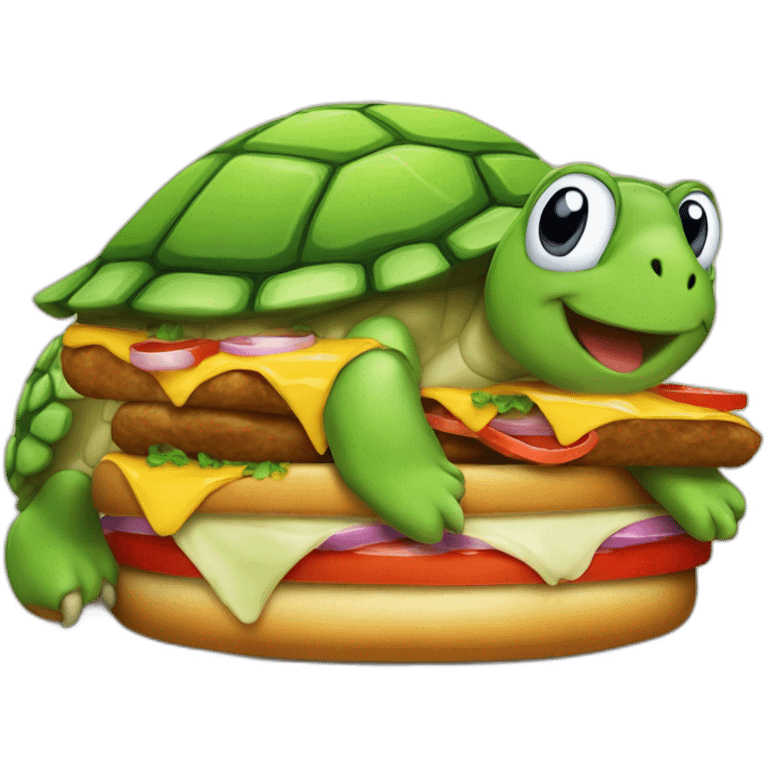

<a id="readme-top"></a>
<!--
*** With gratitude, from https://github.com/othneildrew/Best-README-Template/ 
*** Thanks for checking out the Best-README-Template. If you have a suggestion
*** that would make this better, please fork the repo and create a pull request
*** or simply open an issue with the tag "enhancement".
*** Don't forget to give the project a star!
*** Thanks again! Now go create something AMAZING! :D
-->


<!-- PROJECT LOGO -->
<br />
<div align="center">
  <a href="https://github.com/swoodums/turtle-cafeteria">
    
  </a>

<h3 align="center">Project turtle-cafeteria</h3>

  <p align="center">
    The backend learning project for the meal-planning app turtle-tray.
    <br />
  </p>
</div>


<!-- TABLE OF CONTENTS -->
<details>
  <summary>Table of Contents</summary>
  <ol>
    <li>
      <a href="#about-the-project">About The Project</a>
      <ul>
        <li><a href="#built-with">Built With</a></li>
      </ul>
    </li>
    <li>
      <a href="#getting-started">Getting Started</a>
      <ul>
        <li><a href="#prerequisites">Prerequisites</a></li>
        <li><a href="#installation">Installation</a></li>
      </ul>
    </li>
    <li><a href="#usage">Usage</a></li>
    <li><a href="#roadmap">Roadmap</a></li>
    <li><a href="#license">License</a></li>
    <li><a href="#contact">Contact</a></li>
    <li><a href="#acknowledgments">Acknowledgments</a></li>
  </ol>
</details>


<!-- ABOUT THE PROJECT -->
## About The Project

<!-- ![Product Name Screen Shot][product-screenshot] -->

The objective of this project is to build the backend of a meal-planning application.

This is the first part of a larger project.  See <a href="#roadmap">Roadmap</a>.  Right now, I'm deep into the API.  Much of the documentation is placeholder for the time being.

<p align="right">(<a href="#readme-top">back to top</a>)</p>


### Built With

* Python 3.12.3
* FastAPI
* SQLite

<p align="right">(<a href="#readme-top">back to top</a>)</p>


<!-- GETTING STARTED -->
## Getting Started

Create a virtual environment.
```bash
python -m venv venv
source venv/bin/activate  # Linux/Mac
# or
venv\Scripts\activate   # Windows
```
To get a local copy up and running follow these steps.

### Prerequisites

Use `pip` to install the packages from the `requirements.txt` file.

### Installation

All lorem ipsum since we're still in development

1. Clone the repo
   ```bash
   git clone https://github.com/swoodums/turtle-cafeteria.git
   ```
2. Install required packages
3. Run uvicorn server

<p align="right">(<a href="#readme-top">back to top</a>)</p>


<!-- USAGE EXAMPLES -->
## Usage

Use this space to show useful examples of how a project can be used. Additional screenshots, code examples and demos work well in this space. You may also link to more resources.

_For more examples, please refer to the [Documentation](https://example.com)_

<p align="right">(<a href="#readme-top">back to top</a>)</p>


<!-- ROADMAP -->
## Roadmap

- [x] Develop barebones API endpoints
- [x] Flesh out the README
- [x] Write Tests for API app
- [ ] Build out data structures for recipes.
- [ ] Build out routes for recipes
- [ ] Orchestrate CI in GitHub Actions
- [ ] Orchestrate CD in GitHub Actions
    - Need to have something to deploy, and set up deployment.
- [ ] Build out data structures for scheduling
- [ ] Build out routes for scheduling
- [ ] Start to integrate with a frontend


See the [open issues](https://github.com/swoodums/turtle-cafeteria/issues) for a full list of proposed features (and known issues).

<p align="right">(<a href="#readme-top">back to top</a>)</p>


<!-- LICENSE -->
## License

Distributed under the MIT License. See `LICENSE` for more information.

<p align="right">(<a href="#readme-top">back to top</a>)</p>


<!-- CONTACT -->
## Contact

Sam Woodbeck - [LinkedIn](https://www.linkedin.com/in/samuel-woodbeck-25224230) -  samuel.woodbeck@gmail.com

Project Link: [https://github.com/swoodums/turtle-cafeteria](https://github.com/swoodums/turtle-cafeteria)

<p align="right">(<a href="#readme-top">back to top</a>)</p>


<!-- ACKNOWLEDGMENTS -->
## Acknowledgments

* [Othneil Drew for his great README template](https://github.com/othneildrew)
* [Nick Rossi](https://github.com/NicholasARossi) for on-going tutelage

<p align="right">(<a href="#readme-top">back to top</a>)</p>


<!-- MARKDOWN LINKS & IMAGES -->
<!-- https://www.markdownguide.org/basic-syntax/#reference-style-links -->
[product-screenshot]: images/screenshot.png