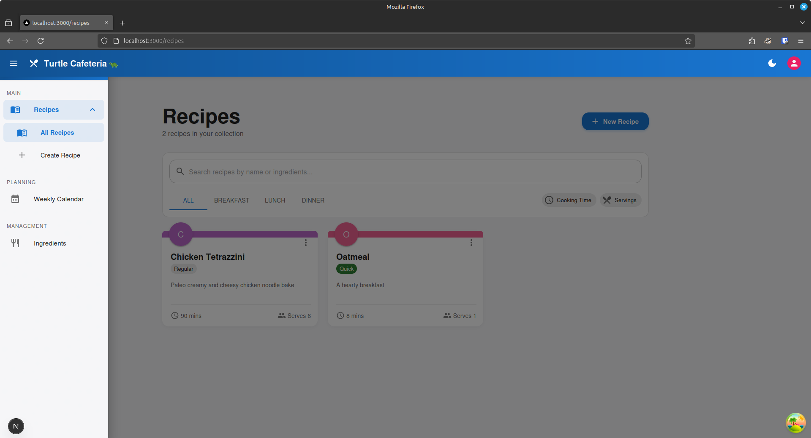
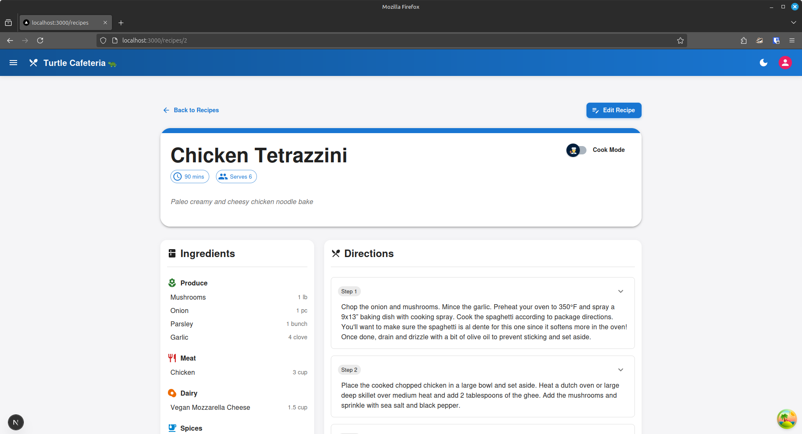

<a id="readme-top"></a>
<!--
*** With gratitude, from https://github.com/othneildrew/Best-README-Template/ 
*** Thanks for checking out the Best-README-Template. If you have a suggestion
*** that would make this better, please fork the repo and create a pull request
*** or simply open an issue with the tag "enhancement".
*** Don't forget to give the project a star!
*** Thanks again! Now go create something AMAZING! :D
-->


<!-- PROJECT LOGO -->
<br />
<div align="center">
    <div>
        <a href="https://github.com/swoodums/turtle-cafeteria">
            
        </a>
    </div>
    
<h3 align="center">Project turtle-cafeteria</h3>
    <p align="center">
        A learning project for the meal-planning app Turtle Cafeteria.
        <br />
    </p>
</div>


<!-- TABLE OF CONTENTS -->
<details>
  <summary>Table of Contents</summary>
  <ol>
    <li>
      <a href="#about-the-project">About The Project</a>
      <ul>
        <li><a href="#built-with">Built With</a></li>
      </ul>
    </li>
    <li>
      <a href="#getting-started">Getting Started</a>
      <ul>
        <li><a href="#prerequisites">Prerequisites</a></li>
        <li><a href="#installation">Installation</a></li>
      </ul>
    </li>
    <li><a href="#usage">Usage</a></li>
    <li><a href="#roadmap">Roadmap</a></li>
    <li><a href="#wishlist">Wishlist</a></li>
    <li><a href="#license">License</a></li>
    <li><a href="#contact">Contact</a></li>
    <li><a href="#acknowledgments">Acknowledgments</a></li>
  </ol>
</details>


<!-- ABOUT THE PROJECT -->
## About The Project

<!-- ![Product Name Screen Shot][product-screenshot] -->

The objective of this project is to build  a meal-planning application.  The goal is to learn and have fun!  I'm building out of personal interest, and to have something for my family to use.  The vision is to have an app that has a recipe book, a scheduling system to plan out meals for the week/month, and an automated shopping list to show what ingredients are needed for the time frame.

We are building this first as a web app.  My personal requirements are to have this accessible on a laptop and on mobile devices.  In my household, that means a Windows, Linux, and Mac laptop, as well as Android and iOS mobile devices!  A web app allows this and keeps the scope reasonable.  We chose Next.js so we have the option to go towards a Progressive Web Application (PWA) later.

The backend is built with FastAPI and SQLite.  The front end is built with Next.js and uses Material UI.  The goal will be to package all of it in a docker container, but for now we're keeping the plates spinning separately.

<p align="right">(<a href="#readme-top">back to top</a>)</p>


### Built With

* Python 3.12.3
* FastAPI
* SQLite
* React
* Next.js
* Material UI

<p align="right">(<a href="#readme-top">back to top</a>)</p>

<!-- ROADMAP -->
## Roadmap

### Back End
- [x] Develop barebones API endpoints
- [x] Flesh out the README
- [x] Write Tests for API app
- [x] Build out data structures for recipes.
- [x] Build out routes for recipes
- [x] Separate Steps from Recipes
- [x] Add middleware to allow frontend communication
- [x] Build out data structures for Recipe Ingredients
- [x] Build out routes for Recipe Ingredients
- [x] Build out data structures for scheduling
- [x] Build out routes for scheduling
- [ ] Build out data structures for Ingredients
- [ ] Build out routes for Ingredients
- [ ] Integrate Ingredients into backend flow
- [ ] Flesh out idea for image storage

### Front End
- [x] Build out barebones frontend
- [x] Verify end-to-end function with backend
- [x] Move create/edit recipe functionality to pages instead of modals
  - [x] Recipe form
  - [x] Create recipe page
  - [x] View recipe page
  - [x] Edit recipe page
- [x] Add navigation
- [x] Create page for scheduling
- [x] Add drag and drop scheduling
- [ ] Create page for creating/editing ingredients
- [ ] Add testing
- [ ] Flesh out idea for images


### Project
- [ ] Put it all in a container
- [ ] Orchestrate CI in GitHub Actions
- [ ] Orchestrate CD in GitHub Actions
    - Need to have something to deploy, and set up deployment.
- [ ] Figure out how to actually host the app vs. running locally

See the [open issues](https://github.com/swoodums/turtle-cafeteria/issues) for a full list of proposed features (and known issues).

<p align="right">(<a href="#readme-top">back to top</a>)</p>

<!-- WISHLIST -->
## Wishlist

What good is learning without dreaming about what it could do?  Here are some dreams that are out of scope for now, but could be worked on later.
* Do it again, but with React Native to allow native functionality on Android and iOS devices.
* Cost analysis based on ingredients
* Nutrition / Macros analysis based on ingredients
* Scraping websites to automatically generate recipes
* Inventory system to compare against what is already on hand
  * Ability to see expiration dates - trending towards a Home Ec ERP
  * If we're dreaming really big, some computer vision to scan what's in the fridge and pantry.

<p align="right">(<a href="#readme-top">back to top</a>)</p>

<!-- USAGE EXAMPLES -->
## Usage

Use the navigation bar on the left to drive!



Click on a recipe card to view the whole recipe!



Create a new recipe!


Schedule a recipe for a date!


_For more examples, please refer to the [Documentation](https://example.com)_

<p align="right">(<a href="#readme-top">back to top</a>)</p>

<!-- GETTING STARTED -->
## Getting Started

Lorem ipsum.  We're in the pre-alpha here, so everything is moving and changing.

### Prerequisites

Python 3 and npm are installed on the local machine

### Installation

Lorem ipsum

1. Clone the repo
   ```bash
   $ git clone https://github.com/swoodums/turtle-cafeteria.git
   ```
2. Install required packages
   1. Back end:
      - Create a virtual environment and activate it:
         ```bash
         $ python -m venv venv
         $ source venv/bin/activate
         ```
      - Install the required packages:
         ```bash
         $ pip install requirements.txt
         ```
   2. Front end:
      - Navigate to the frontend directory and install dependencies:
         ```bash
         $ cd frontend
         $ npm install
         ```
3. Run uvicorn server or fast api dev from the backend directory:
    ```bash
    $ cd backend && fastapi dev
    ```
4. Run the npm dev build from the frontend directory:
    ```bash
    $ cd frontend && npm run dev
    ```
5. To access the app, navigate to http://localhost:3000/recipes
6. To view the back end API documentation, go to http://127.0.0.1:8000/docs#/ or http://127.0.0.1:8000/redoc

<p align="right">(<a href="#readme-top">back to top</a>)</p>

<!-- LICENSE -->
## License

Distributed under the MIT License. See `LICENSE` for more information.

<p align="right">(<a href="#readme-top">back to top</a>)</p>


<!-- CONTACT -->
## Contact

Sam Woodbeck - [LinkedIn](https://www.linkedin.com/in/samuel-woodbeck-25224230) -  samuel.woodbeck@gmail.com

Project Link: [https://github.com/swoodums/turtle-cafeteria](https://github.com/swoodums/turtle-cafeteria)

<p align="right">(<a href="#readme-top">back to top</a>)</p>


<!-- ACKNOWLEDGMENTS -->
## Acknowledgments

* [Othneil Drew for his great README template](https://github.com/othneildrew)
* [Nick Rossi](https://github.com/NicholasARossi) for on-going tutelage

<p align="right">(<a href="#readme-top">back to top</a>)</p>


<!-- MARKDOWN LINKS & IMAGES -->
<!-- https://www.markdownguide.org/basic-syntax/#reference-style-links -->
[product-screenshot]: images/screenshot.png