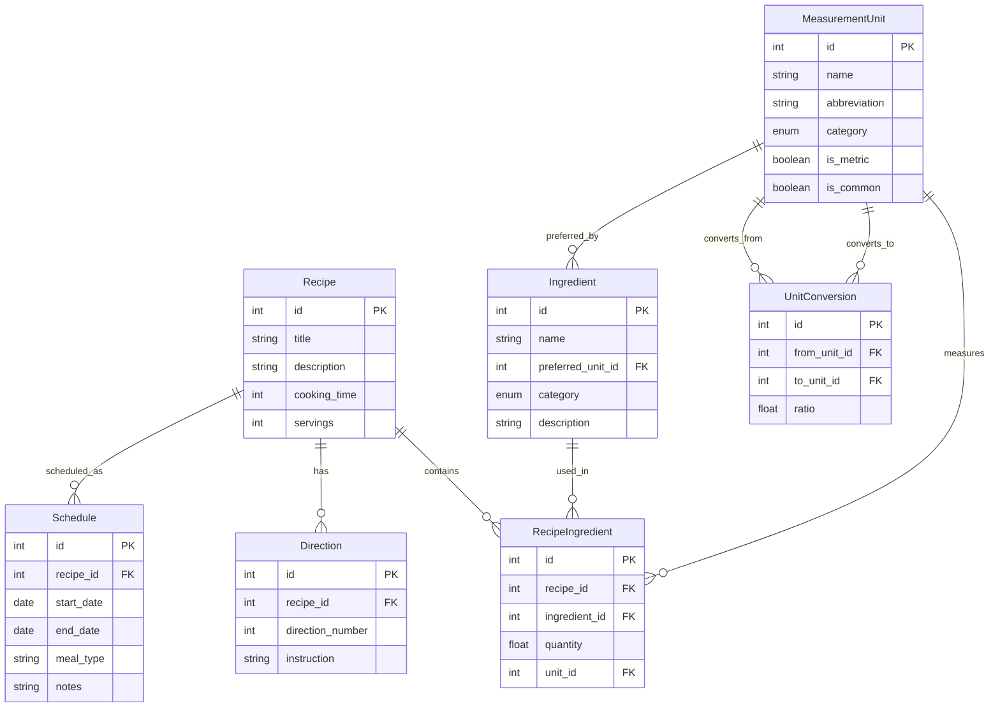

# Database Schema Documentation

This document describes the database schema for the Turtle Cafeteria application. The schema is designed to support recipe management, ingredient tracking, measurement conversions, and meal scheduling.

## Entity Relationship Diagram

## Key Relationships

### Recipe Management
- Each Recipe can have multiple Directions, stored in order using direction_number
- Recipes contain multiple RecipeIngredients, linking to specific Ingredients with quantities
- Recipes can be scheduled multiple times through the Schedule entity

### Ingredient System
- Ingredients are stored in a master list with categorization
- Each Ingredient has a preferred measurement unit for display
- RecipeIngredient joins Recipes and Ingredients, including quantity and unit information

### Measurement System
- MeasurementUnit stores all available units of measure
- UnitConversion enables conversion between different units
- Units are categorized (volume, weight, etc.) and marked as metric/imperial

### Scheduling
- Schedule entity allows recipes to be planned for specific dates
- Each schedule can specify a meal type and include notes
- Date ranges are validated to ensure end_date is not before start_date

## Notes on Implementation

- All tables use integer primary keys
- Foreign keys are used to maintain referential integrity
- Cascading deletes are implemented where appropriate
- Enums are used for categorization (ingredient categories, meal types)
- Constraints ensure data validity (e.g., date ranges in Schedule)